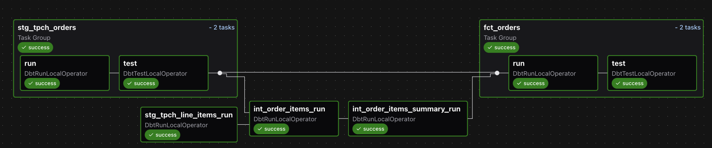
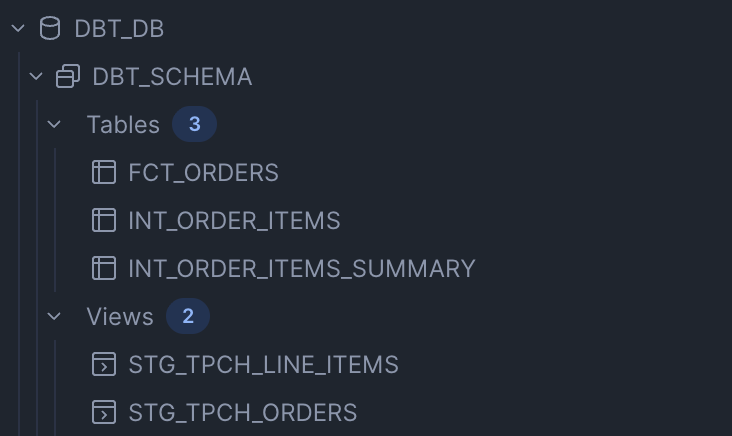

# Airflow + dbt + Snowflake (with Cosmos)

This project demonstrates how to orchestrate a **dbt project on Snowflake** using **Apache Airflow** and the [Astronomer Cosmos](https://github.com/astronomer/astronomer-cosmos) library. The implementation leerages snowflakes built-in TPC-H dataset at a standard scale factor.

It includes:
- A complete dbt project (`dags/data_pipeline/`) with models, macros, and tests
- An Airflow DAG (`dags/dbt_dag.py`) that runs dbt commands using Cosmos
- Dockerized setup with Astro CLI for local development

### 1. Clone the repo
```bash
git clone https://github.com/<github_username>/Snowflake-database-using-dbt-and-Airflow.git
cd Snowflake-database-using-dbt-and-Airflow
```

### Step 2. Prepare Snowflake (one-time setup by an accountadmin)
Before running Airflow or dbt, log into Snowflake (as a user with ACCOUNTADMIN or equivalent privileges) and run:
``` SQL
-- Switch to accountadmin role
USE ROLE ACCOUNTADMIN;

-- Create compute warehouse
CREATE WAREHOUSE IF NOT EXISTS dbt_wh
  WITH WAREHOUSE_SIZE = 'X-SMALL'
  AUTO_SUSPEND = 60
  AUTO_RESUME = TRUE;

-- Create database and role
CREATE DATABASE IF NOT EXISTS dbt_db;
CREATE ROLE IF NOT EXISTS dbt_role;

-- Grant permissions
GRANT USAGE ON WAREHOUSE dbt_wh TO ROLE dbt_role;
GRANT ALL ON DATABASE dbt_db TO ROLE dbt_role;
GRANT ROLE dbt_role TO USER <your_username>;

-- Switch to dbt_role and create schema
USE ROLE dbt_role;
CREATE SCHEMA IF NOT EXISTS dbt_db.dbt_schema;
```
Replace <your_username> with your Snowflake user that Airflow/dbt will connect with.

### 3. Configure environment variables
```bash
cp .env.example .env
```
- Edit .env with actual values.
- For the snowflake account line, include the full address (e.g., https://abc12345.us-east-1.snowflakecomputing.com)
- Per the snowflake setup section, you should be using dbt_db, dbt_schema, dbt_wh and dbt_role for database, schema, warehouse and role respectively.

### 4. Start Airflow locally using Astro CLI
```bash
astro dev init
astro dev start
```
Note: Docker will attempt to use port 5432; ensure this port is available before running 'astro dev start'.

The Airflow UI will be available at: http://localhost:8080
Default credentials:
User: admin
Password: admin

### 5. Create the Snowflake connection in Airflow

Once Airflow is running (astro dev start → http://localhost:8080
), you’ll need to add a Snowflake connection.

Open the Airflow UI → Admin > Connections → + (Add Connection).
- Connection Id: snowflake_conn
- Connection Type: Snowflake
- Host: <your_snowflake_account> (e.g., abc12345.us-east-1)
- Login: your Snowflake username
- Password: your Snowflake password
- Schema: dbt_schema
- Port: leave blank
- In "Extra Field Json" input the following:
``` bash
{
  "account": "<your_snowflake_account> (same as Host field above)",
  "warehouse": "dbt_wh",
  "database": "dbt_db",
  "role": "dbt_role"
}
```
- Click Save.

Your DAG (dbt_dag.py) expects this connection to exist with the name snowflake_conn.
 
 ### 6. Trigger the dbt DAG
 In the Airflow UI:
1. Navigate to DAGs
2. Enable dbt_dag
3. Trigger it manually or wait for its daily schedule


When the DAG runs successfully, you should see all tasks in **Airflow** marked green:


And in **Snowflake**, the expected models and views will be materialized:


	
### Requirements
Defined in requirements.txt:
astronomer-cosmos>=1.10
dbt-core==1.10.10
dbt-snowflake==1.10.0
apache-airflow-providers-snowflake


