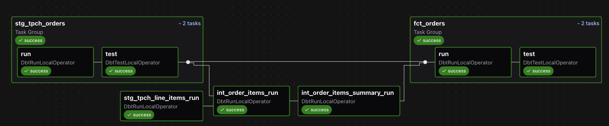
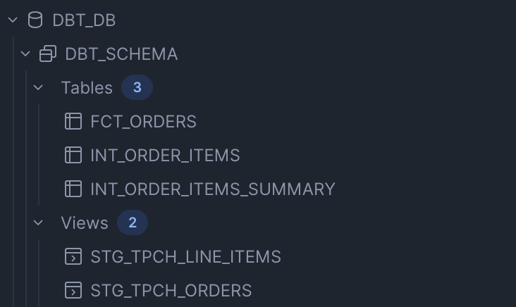

# Airflow + dbt + Snowflake (with Cosmos)

This project demonstrates how to orchestrate a **dbt project on Snowflake** using **Apache Airflow** and the [Astronomer Cosmos](https://github.com/astronomer/astronomer-cosmos) library.  

It includes:
- A complete dbt project (`dags/data_pipeline/`) with models, macros, and tests
- An Airflow DAG (`dags/dbt_dag.py`) that runs dbt commands using Cosmos
- Dockerized setup with Astro CLI for local development

### 1. Clone the repo
```bash
git clone https://github.com/<your-username>/dbt-dag.git
cd dbt-dag
```

### 2. Configure environment variables
```bash
cp .env.example .env
```
- Edit .env with actual values.
- Per the snowflake setup section, you should be using dbt_db, dbt_wh, dbt_role and dbt_schema.

### 3. Start Airflow locally using Astro CLI
```bash
astro dev init
astro dev start
```
Note: Docker will attempt to use port 5432; ensure this port is available before running 'astro dev start'.

The Airflow UI will be available at: http://localhost:8080
Default credentials:
User: admin
Password: admin

### 4. Create the Snowflake connection in Airflow

Once Airflow is running (astro dev start → http://localhost:8080
), you’ll need to add a Snowflake connection.

Open the Airflow UI → Admin > Connections → + (Add Connection).
Fill out the form:
Connection Id: snowflake_conn
Connection Type: Snowflake
Host: <your_snowflake_account>.snowflakecomputing.com (e.g., abc12345.us-east-1.snowflakecomputing.com)
Login: your Snowflake username
Password: your Snowflake password
Schema: dbt_schema
Port: leave blank
In "Extra Field Json" input the following:
``` bash
{
  "account": "your_snowflake_account",
  "warehouse": "dbt_wh",
  "database": "dbt_db",
  "role": "dbt_role",
}
```
Click Save.

Your DAG (dbt_dag.py) expects this connection to exist with the name snowflake_conn.
 
 ### 5. Trigger the dbt DAG
 In the Airflow UI:
1. Navigate to DAGs
2. Enable dbt_dag
3. Trigger it manually or wait for its daily schedule


When the DAG runs successfully, you should see all tasks in **Airflow** marked green:


And in **Snowflake**, the expected models and views will be materialized:


	
### Requirements
Defined in requirements.txt:
astronomer-cosmos>=1.10
dbt-core==1.10.10
dbt-snowflake==1.10.0
apache-airflow-providers-snowflake


